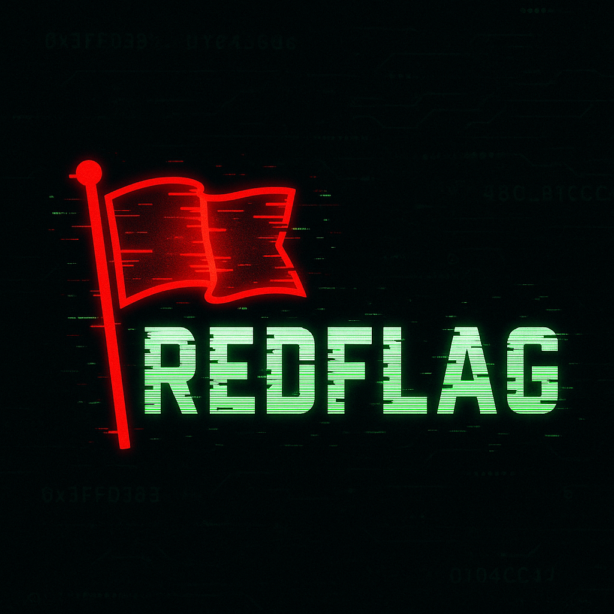

# RedFlag

**RedFlag** is a purposely vulnerable web app built with Go and Redis, designed to simulate real-world session management flaws, broken access control, and classic CTF-style vulnerabilities like IDOR. It's lightweight, fast, and deadly — perfect for red teamers, bug bounty hunters, and anyone learning offensive security.

---

## Features

- Redis-powered session and flag storage
- Broken access control (role escalation via Redis CLI)
- Insecure Direct Object Reference (`/flag-alt`)
- Unauthenticated admin route (`/admin/delete?user=...`)
- Hacker-themed UI and embedded logo
- Full walkthrough included

---

## Tech Stack

- Go (Golang)
- Redis (no DB needed)
- Vanilla HTML/CSS for the frontend

---

## Vulnerabilities to Practice

- Session Hijacking via Redis
- Role Escalation (`role: user` → `admin`)
- IDOR (`/flag-alt?user=admin`)
- Privilege Abuse via Admin Actions (`/admin/delete`)
- Hardcoded flag references in memory
- No session expiration or validation

---

## Setup

1. Start Redis locally:
   ```bash
   redis-server
   ```

2. Run the Go app:
   ```bash
   go run main.go
   ```

3. Visit:
   [http://localhost:8080](http://localhost:8080)

---

## Try These Challenges

- [ ] 🚩 Get your own flag (`/flag?user=you`)
- [ ] 🚨 Steal someone else's flag (`/flag-alt?user=admin`)
- [ ] 💥 Delete a target user via `/admin/delete?user=...`
- [ ] 🧠 Become admin by modifying your session in Redis
- [ ] Race to grab a flag before its TTL expires (add EX option!)

🧠 Need help? Read [`WALKTHROUGH.md`](./RedFlag_WALKTHROUGH.md)

---

## Ideas to Extend

- Add a leaderboard (`/leaderboard`)
- Track logins and deletions with `LPUSH`
- Add `/secure-flag` to show best practice
- Create a Docker version for CTF events

---

## Branding

- Logo by ChatGPT Designer™
- Theme: Retro-hacker terminal meets Redis chaos
- Favicon & style: `/static/redflag-logo.png`

---

## License

MIT

---

## Credits

Created by 404Yeti
Inspired by DVWA, Juice Shop, Redis misconfigs, and all things broken.
